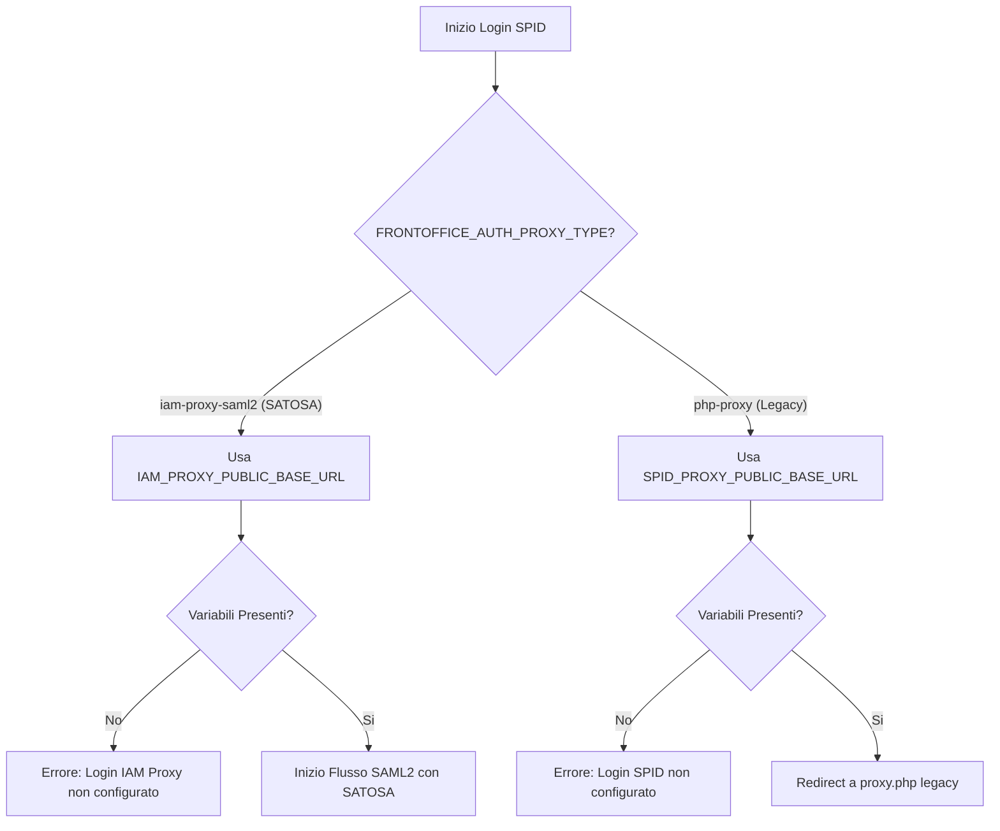

# Piano di Risoluzione: Configurazione Login SPID

Il problema "Login SPID non configurato" è causato dalla mancanza di variabili d'ambiente necessarie nel file [`.env`](.env) per gestire l'autenticazione. Attualmente il frontoffice tenta di utilizzare il proxy PHP legacy (comportamento di default), ma non trova le configurazioni.

Dall'analisi dei file, risulta che il profilo `iam-proxy` (SATOSA) è attivo nel `docker-compose.yml`, quindi la soluzione consigliata è configurare il frontoffice per interfacciarsi con SATOSA tramite SAML2.

## Analisi Tecnica
1. **Modalità Corrente**: Il frontoffice usa `php-proxy` perché la variabile `FRONTOFFICE_AUTH_PROXY_TYPE` non è definita.
2. **Causa Errore**: Mancano `SPID_PROXY_PUBLIC_BASE_URL` e `SPID_PROXY_CLIENT_ID` (richiesti per `php-proxy`).
3. **Soluzione Proposta**: Switch alla modalità `iam-proxy-saml2` che utilizza SATOSA, già configurato in [`.env.iam-proxy`](.env.iam-proxy).

## Diagramma di Flusso (Configurazione)



## Azioni da intraprendere

### 1. Modifica del file [`.env`](.env)
Aggiungere le seguenti variabili per attivare l'integrazione con SATOSA:

```env
# Modalità autenticazione: satosa (SAML2)
FRONTOFFICE_AUTH_PROXY_TYPE=iam-proxy-saml2

# URL pubblico del frontoffice (es. https://frontoffice.esempio.it)
FRONTOFFICE_PUBLIC_BASE_URL=https://localhost:8444

# Variabili ereditate da .env.iam-proxy (assicurarsi che siano visibili al container frontoffice)
SPID_PROXY_PUBLIC_BASE_URL=https://login.mirkochip.eu
```

### 2. Verifica [`.env.iam-proxy`](.env.iam-proxy)
Assicurarsi che le seguenti variabili siano corrette per l'ambiente di rete:
- `IAM_PROXY_SAML2_IDP_METADATA_URL_INTERNAL`: dovrebbe puntare a `https://satosa-nginx:443/Saml2IDP/metadata` (comunicazione interna tra container).

### 3. Allineamento Redirect URI
Configurare SATOSA per accettare il redirect dal frontoffice. In SATOSA (gestito tramite i file in `iam-proxy/`), il frontoffice è visto come un Service Provider (SP).

---
**Nota**: Se si preferisce utilizzare il proxy PHP legacy (non raccomandato se SATOSA è presente), dovranno essere configurate le variabili `SPID_PROXY_*` menzionate nel messaggio di errore originale.
